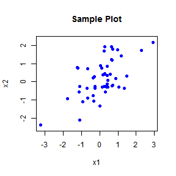

## Introduction
These slides have been created as part of the Data Products project on Coursera.

The following slides will describe the Shiny App that was created as part of the project. The Shiny App demonstrates the change in distribution of two sets of random variables as the correlation between them is modified. 

The app is available at - [ShinyApp](http://pavankb.shinyapps.io/DataProdProject)

--- .class #id 

## Math 

Correlated random variables can be generated as follows, for two datasets x_1 and x_2 from the same distribution 
$$ y = \rho x_1 + x_2\sqrt{1-\rho^2}  $$
Now `y` and `x1` are correlated with $\rho$


```r
x1 <- rnorm(50);x2 <- 0.5*x1 +sqrt(1-0.5^2)*rnorm(50)
plot(x1,x2,pch=19,col='blue',xlab='x1',ylab='x2',asp = 1, main = 'Sample Plot')
```



--- .class #id 

## UI
The Shiny application contains the following controls:

**Seed** - Set this to ensure that simulation can be recreated

**Distribution** - Choose the distribution from which the random variables will be generated. There are three options
* Std.Normal
* t-Distribution - Degrees of Freedom = 20
* Chi- Square distribution - Degrees of Freedom = 20

**Number of points** - Set  the number of points to be plotted on the graph.

**Correlation** - Set the value for the correlation between the two sets of variables.

--- .class #id 

## Output

Every time a parameter is modified, the app will automatically generate a new graph. The parameters used to generate it are summarised on the title.

The graph also plots the guidelines :  `y=x`, `y=-x` and the regression line (in red), so that the user can  compare the results as $\rho$ is modified.

As $\rho$ tends to 1 the points align themselves along `y=x`
similarly as $\rho$ tends to -1 the points will align themselves to `y=-x`
